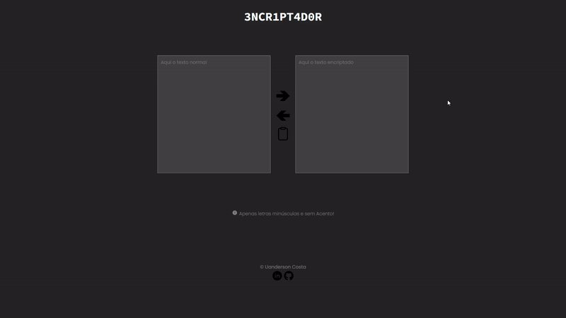

# Challenge do programa One - Oracle & Alura!

👀 Previa do Encriptador

[
](https://github.com/uandersoncosta/challengeEncriptadorAlura)
 
  

### 👊 Sobre o desafio
Foi proposto criar uma criptografa textos, assim você poderá trocar mensagens secretas com outras pessoas que saibam o segredo da criptografia utilizada.
 

As **"chaves"** de criptografia que utilizaremos são:

A letra **"e"** é convertida para **"enter"**

A letra **"i"** é convertida para **"imes"**

A letra **"a"** é convertida para **"ai"**

A letra **"o"** é convertida para **"ober"**

A letra **"u"** é convertida para **"ufat"**

**Requisitos:**
- Deve funcionar apenas com letras minúsculas
- Não devem ser utilizados letras com acentos nem caracteres especiais
- Deve ser possível converter uma palavra para a versão criptografada e também retornar uma palavra criptografada para a versão original.

## 🔗 Links uteis

[
](https://www.linkedin.com/in/uandersoncosta/)

